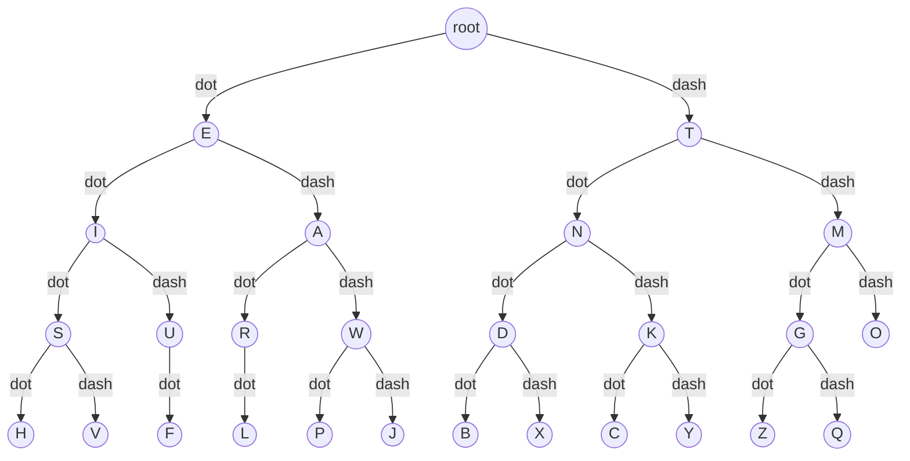

# MorseTree
This script uses a binary tree for decoding Morse code. Each dot represents a left traversal and each dash represents a right traversal in the tree. Symbols are separated by **one** space, and words are separated by **two** spaces.

For simplicity, a dictionary is used for the encoding.

## Morse Code Tree Structure


## How to run the script
1. Clone and run locally:
```bash
git clone https://github.com/andreas-hkr/MorseTree.git
cd MorseTree
python3 main.py
```
2. Fetch and run directly:
```bash
curl -L https://raw.githubusercontent.com/andreas-hkr/MorseTree/main/main.py | python3
```

**WARNING:** The direct fetch method may pose security risks. Review the code before executing it.
